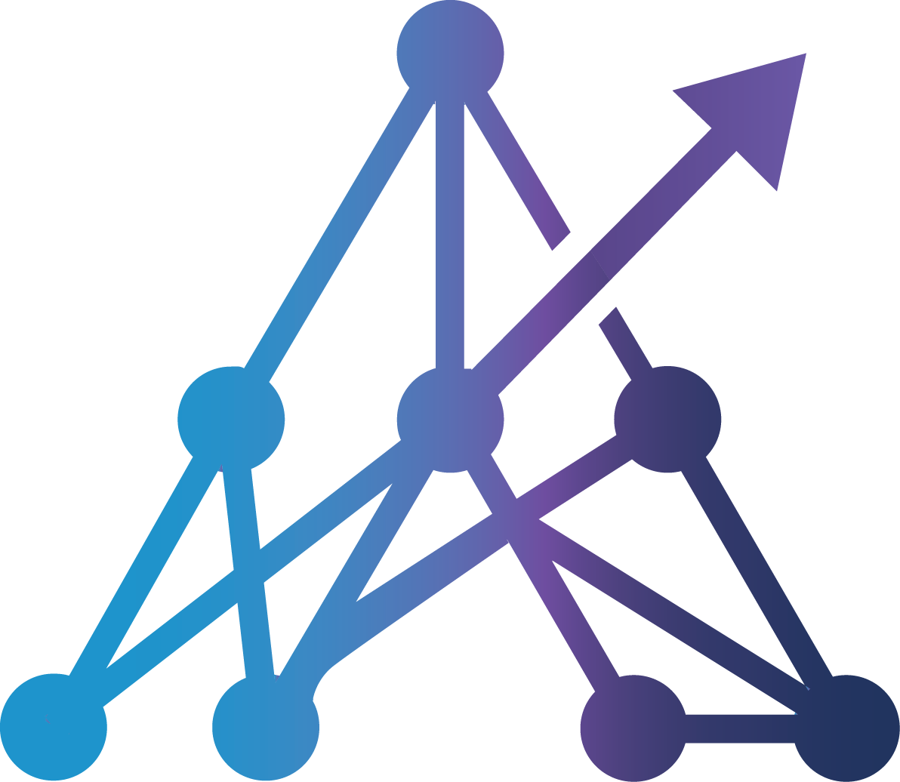

# igedits

**igedits** is a self-hosted, AI-powered video clipping tool — an open-source alternative to [OpusClip](https://www.opus.pro/), extended with additional features and full control over your own infrastructure. Feed it a long-form video (YouTube URL or direct upload) and it returns a handful of short, vertical (9:16) clips with word-synced captions, face-centered cropping, and virality scoring — ready for TikTok, Reels, or Shorts.

No watermarks, no per-minute quotas, no vendor lock-in.

## What it does

1. **Ingest** — pull a video from a YouTube URL (via `yt-dlp`) or accept a direct upload.
2. **Transcribe** — word-level timestamps via AssemblyAI (cloud) or optional local Whisper.
3. **Analyze** — a Pydantic-AI agent selects 3–7 viral segments (10–45s each) and scores them on hook / engagement / value / shareability.
4. **Render** — MoviePy assembles each segment into a 9:16 clip with configurable crop position (left / center / right, or auto face-detect), burned-in captions, optional transitions, and optional B-roll overlays.
5. **Serve** — clips are stored on disk and surfaced to the frontend for preview, editing, and export.

---

## Architecture

```
User → Frontend (Next.js 15) → Backend API (FastAPI) → Redis Queue → ARQ Worker
                                      ↓                                  ↓
                               PostgreSQL ←───────────────────────────────┘
```

Task creation returns in <100 ms. The worker handles the heavy video work asynchronously; the frontend subscribes via Server-Sent Events for live progress.

| Service    | Port | Purpose                                 |
| ---------- | ---- | --------------------------------------- |
| Frontend   | 3000 | Next.js UI                              |
| Backend    | 8000 | FastAPI (OpenAPI docs at `/docs`)       |
| Worker     | —    | ARQ job runner (no exposed port)        |
| PostgreSQL | 5432 | Task + user data                        |
| Redis      | 6379 | Job queue + progress pub/sub            |

---

## Deployment

### Prerequisites

- Docker + Docker Compose
- An [AssemblyAI](https://www.assemblyai.com/) API key for transcription
- One LLM provider key: Google Gemini, OpenAI, Anthropic, or a local/remote Ollama instance

### API keys — where to get them

| Key | Free tier | Paid | Where to get it |
|-----|-----------|------|-----------------|
| `ASSEMBLY_AI_API_KEY` | 100 hours/month free | ~$0.65/hour after | [assemblyai.com](https://www.assemblyai.com/) → sign up → API keys |
| `GOOGLE_API_KEY` | Generous free quota via AI Studio | Pay-per-token after | [aistudio.google.com](https://aistudio.google.com/) → Get API key |
| `OPENAI_API_KEY` | No free tier (credits expire) | Pay-per-token | [platform.openai.com](https://platform.openai.com/) → API keys |
| `ANTHROPIC_API_KEY` | No free tier | Pay-per-token | [console.anthropic.com](https://console.anthropic.com/) → API keys |
| Ollama (local) | Free — runs on your hardware | Free | Install [ollama.ai](https://ollama.ai/), no key needed for local |
| `OLLAMA_API_KEY` | — | Paid (Ollama Cloud only) | [ollama.ai](https://ollama.ai/) — only needed for Ollama Cloud, not local |
| `PEXELS_API_KEY` | Free, unlimited | Free | [pexels.com/api](https://www.pexels.com/api/) → Get free API key |
| `APIFY_API_TOKEN` | $5 free monthly credit | ~$0.25/1000 results | [apify.com](https://apify.com/) → Settings → Integrations |
| `YOUTUBE_DATA_API_KEY` | 10,000 units/day free | Paid quota extensions | [Google Cloud Console](https://console.cloud.google.com/) → APIs → YouTube Data API v3 |
| `RESEND_API_KEY` | 3,000 emails/month free | Paid after | [resend.com](https://resend.com/) → sign up → API keys |

**Minimum to get started**: `ASSEMBLY_AI_API_KEY` + one LLM key. Everything else is optional.

**Recommended free stack**: AssemblyAI (free tier) + Google Gemini via AI Studio (free quota) + Pexels (free). Zero cost for light personal use.

### 1. Clone

```bash
git clone git@github.com:tass055/Igedits.git
cd Igedits
```

### 2. Create `.env` in the project root

Start from this minimal working config:

```env
# ── Required: transcription ───────────────────────────────
ASSEMBLY_AI_API_KEY=your_assemblyai_key

# ── Required: LLM provider (pick ONE) ─────────────────────
LLM=google-gla:gemini-2.0-flash
GOOGLE_API_KEY=your_google_key
# LLM=openai:gpt-5.2
# OPENAI_API_KEY=...
# LLM=anthropic:claude-4-sonnet
# ANTHROPIC_API_KEY=...
# LLM=ollama:gpt-oss:20b
# OLLAMA_BASE_URL=http://host.docker.internal:11434/v1

# ── Required in production ────────────────────────────────
BETTER_AUTH_SECRET=change_me_to_a_long_random_string
BACKEND_AUTH_SECRET=change_me_too
NEXT_PUBLIC_APP_URL=https://your-domain.com

# ── Optional ──────────────────────────────────────────────
PEXELS_API_KEY=...                     # Enables B-roll overlays
YOUTUBE_METADATA_PROVIDER=yt_dlp       # or: youtube_data_api
YOUTUBE_DATA_API_KEY=...
RESEND_API_KEY=...                     # Transactional emails
RESEND_FROM_EMAIL=no-reply@your-domain.com
```

### 3. Start

**Option A — quick-start script** (validates your `.env` and checks Docker before launching):

```bash
bash start.sh
```

**Option B — direct compose**:

```bash
docker compose up -d --build
# first boot pulls images and runs init.sql — tail with:
docker compose logs -f
```

Open **http://localhost:3000**, create an account, and submit a video.

### 4. Production checklist

- Replace `BETTER_AUTH_SECRET` and `BACKEND_AUTH_SECRET` with long random values (`openssl rand -hex 32`).
- **Close backend port 8000** — in `docker-compose.yml`, remove or comment out the `ports:` block under the `backend` service. The frontend talks to it over the internal Docker network (`http://backend:8000`) so external exposure is unnecessary and a security risk.
- Put the stack behind an HTTPS reverse proxy (Caddy, Nginx, Traefik). Only port 3000 (frontend) needs to be public.
- Set `NEXT_PUBLIC_APP_URL` and `CORS_ORIGINS` to your public domain.
- Set a strong `POSTGRES_PASSWORD` — never leave it as the default.
- Run PostgreSQL outside the container with regular backups for anything important.
- Persist the `uploads`, `clips`, `redis_data`, and `postgres_data` Docker volumes.

---

## GPU vs CPU

The default encoder is **CPU (libx264)**. Switching to NVIDIA GPU encoding is a single env var — no code or Dockerfile changes needed.

### CPU (default)

Nothing to configure. The stack ships CPU-ready:

```env
VIDEO_ENCODER=cpu   # default — libx264
```

The two heaviest workloads are offloaded to the cloud:
- **Transcription** → AssemblyAI (cloud API, no local model)
- **LLM analysis** → your chosen provider (cloud or Ollama)

The only local CPU work is FFmpeg encoding — tune it with these vars:

| Variable                      | Default    | Effect                                                         |
| ----------------------------- | ---------- | -------------------------------------------------------------- |
| `DEFAULT_PROCESSING_MODE`     | `fast`     | `fast` \| `balanced` \| `quality` — encoder preset & features  |
| `FAST_MODE_MAX_CLIPS`         | `4`        | Caps clip count in fast mode                                   |
| `FAST_MODE_TRANSCRIPT_MODEL`  | `nano`     | AssemblyAI model tier for fast mode                            |
| `QUEUED_TASK_TIMEOUT_SECONDS` | `180`      | Fail-safe for stuck tasks                                      |

### GPU (NVENC — NVIDIA only)

Requirements: NVIDIA GPU, [NVIDIA Container Toolkit](https://docs.nvidia.com/datacenter/cloud-native/container-toolkit/install-guide.html) installed on the host.

**Step 1** — set the encoder in `.env`:

```env
VIDEO_ENCODER=nvenc
```

**Step 2** — in `docker-compose.yml`, on the `worker` service, comment out the CPU `deploy` block and uncomment the GPU `deploy` block. The blocks are already in the file — just swap the comments:

```yaml
# Comment this out:
# deploy:
#   resources:
#     limits:
#       cpus: "4.0"
#       memory: 6G

# Uncomment this:
deploy:
  resources:
    reservations:
      devices:
        - driver: nvidia
          count: 1
          capabilities: [gpu]
```

The `backend` service already has a GPU device reservation in `docker-compose.yml` — no changes needed there.

**Step 3** — recreate both containers so the device reservation takes effect:

```bash
docker compose up -d --no-deps --build backend worker
```

Both the `worker` (clip generation) and `backend` (trim / split / regenerate) pick up `VIDEO_ENCODER=nvenc` and switch FFmpeg to `h264_nvenc` automatically.

> **AMD / Intel GPU**: not supported out of the box. You would need to swap the Dockerfile base image and install a compatible FFmpeg build.

### Local Whisper (no AssemblyAI)

The `WHISPER_MODEL_SIZE` env var (`tiny` / `base` / `small` / `medium` / `large`) is wired in the config, but the local Whisper path requires a CUDA-enabled PyTorch install inside the container — a Dockerfile change. If you want this, raise an issue.

---

## Language, transcripts, and subtitles

### Transcript language

There is **no transcript language env var** — language is auto-detected by AssemblyAI. For non-English source videos, results depend entirely on AssemblyAI's detection; no UI toggle exists today.

| Variable                     | Default  | Purpose                                                |
| ---------------------------- | -------- | ------------------------------------------------------ |
| `ASSEMBLY_AI_API_KEY`        | —        | Required; drives transcription                         |
| `FAST_MODE_TRANSCRIPT_MODEL` | `nano`   | Model tier when `DEFAULT_PROCESSING_MODE=fast`         |
| `WHISPER_MODEL_SIZE`         | `medium` | Only used if the local Whisper path is enabled (no GPU by default — see above) |

### Subtitles / captions

Subtitle appearance is **configured per task**, not via env vars. Every task carries:

- `font_family` (default `TikTokSans-Regular`) — pick from any `.ttf` in `backend/fonts/`
- `font_size` (default `24`)
- `font_color` (default `#FFFFFF`)
- `caption_template` (default `default`) — see below

Defaults for new tasks can be set per-user under **Settings**.

### Caption templates

Templates live in `backend/src/caption_templates.py` and bundle animation style, highlight color, stroke, shadow, and vertical position:

| Template  | Style                                            |
| --------- | ------------------------------------------------ |
| `default` | Clean white text, soft stroke                    |
| `hormozi` | Bold yellow highlight, thick black stroke        |
| `mrbeast` | Large red highlight, heavy stroke, drop shadow   |
| `minimal` | Thin text, no highlight                          |
| `tiktok`  | Karaoke-style word highlighting                  |
| `neon`    | Bright glow highlight                            |
| `podcast` | Centered, small, low-key                         |

### Arabic, Urdu, and RTL languages

igedits automatically detects Arabic-script text (Arabic, Urdu, etc.) in transcripts and handles it correctly:

- Switches to the bundled **Noto Naskh Arabic** font so glyphs render instead of boxes.
- Applies letter-shaping (`arabic-reshaper`) and the Unicode bidi algorithm (`python-bidi`) so characters form proper ligatures and display right-to-left.

No configuration needed — it is automatic. For other non-Latin scripts (e.g. Devanagari, CJK), drop a compatible `.ttf` into `backend/fonts/` and select it as your font for that task; the font picker will surface it automatically.

### Adding assets

- **Fonts**: drop `.ttf` files into `backend/fonts/` — they appear in the font picker automatically.
- **Transitions**: drop `.mp4` files into `backend/transitions/` — surfaced via `GET /transitions`.

---

## Instagram publishing

Two methods are available. The backend tries **Method A first**; if no webhook is configured it falls back to **Method B**.

### Method A — Make.com webhook (Business/Creator accounts)

Requires an Instagram **Creator** or **Business** account linked to a Facebook Page. Personal accounts cannot publish Reels via the Meta API.

> If your account is personal: Instagram → Settings → Account → Switch to Professional Account → Creator.

**Set up the Make.com scenario:**

1. Sign up at [make.com](https://make.com) → **Scenarios** → **Create a new scenario**.
2. Add module: **Webhooks → Custom webhook** → click **Add** → name it "igedits" → **Save**. Copy the webhook URL.
3. Add module: **Instagram for Business → Create a Reel**.
4. In **Connection** → **Add** → log in with the Facebook account linked to your Instagram → grant permissions.
5. Fill in:
   - **Page** → select your Facebook Page.
   - **Video URL** → enable mapping → `{{1.video_url}}`
   - **Caption** → `{{1.caption}}`
6. **OK** → **Save** → **Activate scenario**.

> **No Facebook Page?** Required by Meta regardless of tool. Go to [Meta Business Suite](https://business.facebook.com) → Add Page → connect your Instagram.

**Connect to igedits:**

```env
MAKE_INSTAGRAM_WEBHOOK_URL=https://hook.eu2.make.com/xxxxxxxxxxxxxxxxxxxxxxxx
PUBLIC_BASE_URL=https://your-backend-domain.com   # Make.com must reach this to download clips
```

Restart: `docker compose up -d backend`

---

### Method B — Direct login (any account, no Make.com needed)

Connect your Instagram account with just a username and password — no Meta Developer App, no OAuth, no Facebook Page required. Works with personal accounts.

**Set up:**

1. Open igedits → **Settings → Integrations**.
2. Enter your Instagram username and password → **Connect**.
3. The status shows **Connected as @username** when ready.

**Publish:** Open any completed task → click **Post to Instagram** on a clip → enter a caption → **Post**. The clip uploads as a Reel directly from your server.

**Limitations:**
- Accounts with **2FA enabled** are not supported — disable 2FA or use a secondary account without 2FA.
- On first login from a new server, Instagram may send a **verification challenge** (email/SMS code). If this happens, log in from your phone first to clear the challenge, then try again.
- Credentials are **encrypted at rest** (Fernet/AES-256) and stored only on your server. Sessions are cached so re-login is rare.
- This method uses the unofficial Instagram private API. It is not affiliated with or endorsed by Meta.

---

### How publishing works

When you click **Publish to Instagram** on a clip:

- If `MAKE_INSTAGRAM_WEBHOOK_URL` is set → the backend sends `{ "video_url": "...", "caption": "..." }` to Make.com, which downloads and posts the Reel (~30 seconds).
- Otherwise → the backend uploads the clip file directly via the direct-login session.

---

## Auto-updates

`install_cron.sh` installs a cron job that pulls the latest changes from git and restarts Docker every 3 hours — useful for keeping a self-hosted instance current without manual intervention.

```bash
bash install_cron.sh
```

What it does:
- Creates `.cron/update_and_restart.sh` in the repo directory.
- Adds a crontab entry (`0 */3 * * *`) that runs the updater.
- The updater skips if there are local uncommitted changes (safe to run alongside custom `.env` edits).
- Logs to `cron_update.log` in the repo root.

To remove: `crontab -e` and delete the lines between `# igedits-auto-update-start` and `# igedits-auto-update-end`.

---

## App navigation

All pages are under `frontend/src/app/` (Next.js App Router).

| Route                  | What it's for                                                                                              |
| ---------------------- | ---------------------------------------------------------------------------------------------------------- |
| `/`                    | Landing + quick-create: paste a YouTube URL or upload a file, pick font/template, start a task.            |
| `/sign-up`, `/sign-in` | Email/password auth (Better Auth).                                                                         |
| `/list`                | All of your tasks with status, clip count, and inline start / resume / delete actions.                     |
| `/tasks/[id]`          | Gallery view for a completed task — all generated clips with virality score, timestamps, and previews.     |
| `/tasks/[id]/edit`     | Per-clip editor: trim, split, merge, edit captions, toggle audio, and export with platform presets.        |
| `/settings`            | User defaults: default font, size, color, email notifications.                                             |
| `/admin`               | Admin-only: user metrics, task metrics, dead-letter queue, per-user admin toggle.                          |

### Typical flow

1. Sign up → land on `/`.
2. Paste a YouTube URL or upload a file, click **Start**.
3. Watch progress stream live (SSE) on the same page.
4. When the task completes, jump to `/tasks/[id]` to browse generated clips.
5. Open any clip in `/tasks/[id]/edit` to trim or re-caption it, then export.
6. All past tasks are available under `/list`.

---

## Local development (without Docker)

Backend uses `uv`, not pip/poetry. Requires Python 3.11+, ffmpeg, and running PostgreSQL + Redis.

```bash
# Backend API
cd backend && uv venv .venv && source .venv/bin/activate && uv sync
uvicorn src.main_refactored:app --reload --host 0.0.0.0 --port 8000

# Worker (required — video processing runs here)
arq src.workers.tasks.WorkerSettings

# Frontend
cd frontend && npm install && npm run dev
```

More detail in [CLAUDE.md](CLAUDE.md) and [`docs/`](docs/README.md).

---

## Testing

```bash
make test           # everything
make test-backend   # pytest
make test-frontend  # vitest + testing-library
make test-e2e       # playwright smoke suite
```

CI runs the same layers with Postgres and Redis service containers.

---

## License

AGPL-3.0. See [LICENSE](LICENSE).

---

## Powered by ASAL

igedits is built and maintained by [**ASAL**](https://asal.life) — a technology company focused on AI-powered tools and automation.

[](https://asal.life)

| Platform | Link |
|---|---|
| 🌐 Website | [asal.life](https://asal.life/) |
| 📘 Facebook | [facebook.com/profile.php?id=61573255537897](https://www.facebook.com/profile.php?id=61573255537897) |
| 📸 Instagram | [@asallifeoriginal](https://www.instagram.com/asallifeoriginal/) |
| ▶️ YouTube | [@AsalLlife](https://www.youtube.com/@AsalLlife) |
| 🎵 TikTok | [@asallifeoriginal](https://www.tiktok.com/@asallifeoriginal) |
| 🧵 Threads | [@asallifeoriginal](https://www.threads.com/@asallifeoriginal) |
